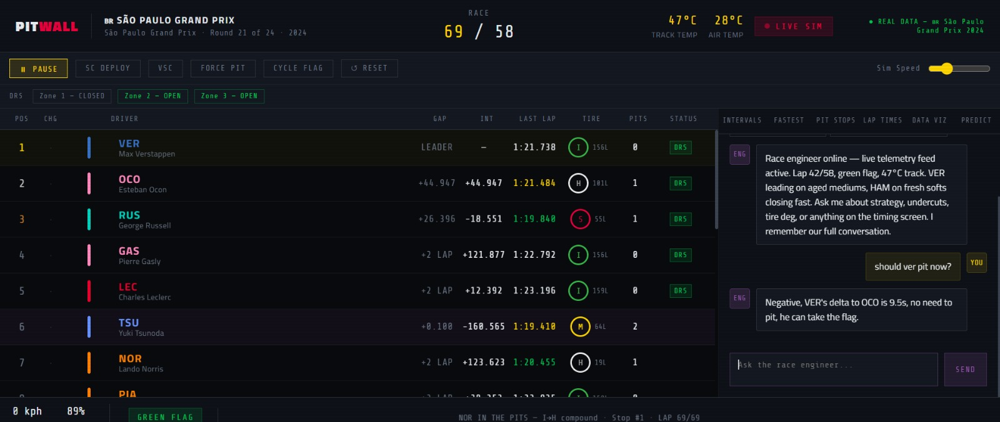

# 🏎 PitWall — F1 Race Intelligence Dashboard

> Real-time Formula 1 strategy analysis powered by FastF1 telemetry data and an AI race engineer running on Groq (Llama 3.3 70B).

**[→ Live Demo](https://pitwall-lilac.vercel.app)** &nbsp;|&nbsp; **[→ Data Pipeline](scripts/fetch_race_data.py)** &nbsp;|&nbsp; **[→ GitHub](https://github.com/Sanss25/f1-intelligence-dashboard)**



---

## What This Is

PitWall is a full-stack data engineering project that ingests **real Formula 1 telemetry** from the official F1 timing feed via the FastF1 Python library, processes it through a Python ETL pipeline, and renders it as a live race intelligence dashboard — the kind of interface a real pit wall engineer uses during a race.

The AI race engineer connects to **Llama 3.3 70B via Groq** through a secure Vercel serverless proxy, giving you instant pit wall radio-style strategy advice with live access to race state, tire data, gaps, and lap history.

Currently loaded with real data from the **🇧🇷 São Paulo Grand Prix 2024** — 20 drivers, 36 pit stops, 10 drivers with full FastF1 telemetry.

---

## Tech Stack

| Layer | Technology |
|---|---|
| **Data Pipeline** | Python · FastF1 · Pandas · NumPy |
| **Frontend** | Vanilla JS · HTML5 Canvas API · CSS Grid |
| **AI Backend** | Groq API — Llama 3.3 70B (free tier) |
| **API Proxy** | Vercel Serverless Function (Node.js) |
| **Live Data** | OpenF1 API — real-time session polling every 5s |
| **Deployment** | Vercel (static + serverless) |
| **Data Source** | Official F1 timing feed via FastF1 |

---

## Features

### 🏁 Real Data Pipeline
- Pulls **actual lap times, pit stop records, sector times, and telemetry** from any F1 race (2018–present)
- Speed, Throttle, Brake, RPM, Gear at 4Hz resolution from real onboard sensors
- Weather data: track temp, air temp, humidity, wind speed
- Graceful fallback to simulation mode when `race_data.json` is not present

### 📊 Live Timing Tower
- 20-driver live timing grid with real-time position changes, gaps, and intervals
- Tire compound tracking (Soft / Medium / Hard / Inter / Wet) with age in laps
- Real pit stop log with actual stop durations from FastF1 timing data
- Flag state simulation (Green / Yellow / Safety Car / VSC)
- Click any driver row to open a detailed stats drawer with lap history and gap evolution charts
- Collapsible tower (keyboard shortcut `T`) to maximise panel space

### 🔮 ML Win Probability Model (`Predict` tab)
- Ensemble model scoring each driver's win probability every lap
- 6 features: gap to leader (scaled by laps remaining), tire compound + age, pace trend direction, pit stops remaining, DRS eligibility, Safety Car risk
- Probabilities normalised across all 20 drivers, shown as ranked cards with progress bars
- Feature importance panel for the current race leader

### 📡 Telemetry Tab
- Speed / Throttle / Brake bars per driver — real FastF1 data marked `FF1`, simulation marked `SIM`
- Real sector times (S1 / S2 / S3) from each driver's fastest lap
- Tire degradation model: exponential decay curves for S/M/H compounds with current driver positions plotted live

### 🎯 Strategy Recommender (`Strategy` tab)
- Live pit recommendations for top 10 drivers: `PIT NOW` / `STAY OUT` / `WATCH` / `OVERCUT?`
- Undercut window detector — flags viable gaps between cars
- Updates every lap based on tire age, life remaining, laps left, and gap to car ahead/behind
- Tire strategy overview: stinted stint visualisation for top 10 drivers

### ⚖️ Driver Compare (`Compare` tab)
- Head-to-head comparison of any two drivers from a dropdown
- Metrics: best lap, last lap, average lap, tire health %, gap, DRS, pit stops
- Side-by-side lap time evolution chart on canvas

### 🗂️ Data Viz Tab
- Pace distribution bar chart (Sector 1/2/3 breakdown per driver)
- Gap evolution line chart (last 15 laps, top 5 drivers)
- Tire strategy overview (full stint timeline)

### 💬 AI Race Engineer
- Floating 🎙️ microphone button (bottom-right) — accessible from any tab without leaving the current view
- Also accessible via `AI AGENT` badge in the header
- Full conversation with live race context injected every message (lap, gaps, tires, flag state)
- Conversation history maintained across turns (last 10 messages)
- Responds in genuine pit wall radio style: undercut, overcut, deg, delta, SC window, DRS train
- Calls Groq through a **secure server-side proxy** — API key never exposed in the browser

### 🔴 OpenF1 Live Polling
- `LIVE DATA ON` button polls the OpenF1 API every 5 seconds during active sessions
- Merges live timing, pit stops, weather, and flag state into the dashboard in real time
- Automatically falls back to simulation mode if OpenF1 is unavailable

### 📦 Data Hub Tab
- Dataset cards linking to Kaggle F1 Championship dataset and FastF1 GitHub
- All-time constructor wins bar chart (Ferrari, McLaren, Mercedes, Red Bull…)
- FastF1 four-pillar data model reference (Timing / Telemetry / Positional / Environment)

---

## Architecture

```
┌─────────────────────────────────────────────────────────────┐
│                   DATA PIPELINE (Python)                     │
│                                                             │
│  Official F1 Timing Feed                                    │
│       ↓                                                     │
│  FastF1 Library  ──→  fetch_race_data.py  ──→  race_data.json│
│  (lap times,           (clean, transform,     (public/data/) │
│   telemetry,            normalise, export)                   │
│   weather, pits)                                            │
└──────────────────────────┬──────────────────────────────────┘
                           │ loaded on startup
                           ↓
┌─────────────────────────────────────────────────────────────┐
│                    FRONTEND (Browser)                        │
│                                                             │
│  index.html                                                 │
│      │──→ Timing tower · Canvas charts · Telemetry bars    │
│      │──→ ML model (client-side ensemble scoring)           │
│      │──→ OpenF1 API polling every 5s (live sessions)      │
│      └──→ fetch('/api/engineer') ──→ Vercel Function        │
└──────────────────────────┬──────────────────────────────────┘
                           │
                           ↓
┌─────────────────────────────────────────────────────────────┐
│                API PROXY (Vercel Serverless)                 │
│                                                             │
│  /api/engineer.js                                           │
│       ↓                                                     │
│  Groq API — Llama 3.3 70B                                   │
│  (GROQ_API_KEY stored as env var, never in browser)         │
└─────────────────────────────────────────────────────────────┘
```

---

## Navigation

The dashboard uses a **top navigation bar** with 10 tabs:

| Tab | Icon | What it shows |
|---|---|---|
| Intervals | 📊 | Gap to leader bars + session fastest laps |
| Fastest | ⚡ | Full fastest lap classification |
| Pit Stops | 🔧 | Pit log + tire strategy overview |
| Lap Times | 📈 | Lap time evolution + gap/pace charts |
| Strategy | 🎯 | Pit recommendations + undercut windows |
| Predict | 🔮 | ML win probability model |
| Compare | ⚖️ | Driver head-to-head comparison |
| Telemetry | 📡 | Speed/throttle/brake + tire degradation |
| Data Viz | 🗂️ | Sector pace + gap evolution + strategy |
| Data Hub | 📦 | Datasets, resources, constructor wins |

AI Race Engineer is accessible via the floating **🎙️** microphone button (bottom-right) from any tab.

---

## Keyboard Shortcuts

| Key | Action |
|---|---|
| `Space` | Pause / Resume simulation |
| `S` | Deploy Safety Car |
| `V` | Virtual Safety Car |
| `P` | Force random pit stop |
| `R` | Reset race |
| `T` | Collapse/expand timing tower |
| `A` | Toggle AI Race Engineer |
| `?` | Toggle shortcuts panel |

---

## Local Setup

### 1. Clone and install

```bash
git clone https://github.com/Sanss25/f1-intelligence-dashboard
cd f1-intelligence-dashboard

# Python pipeline deps
pip install -r requirements.txt

# Vercel CLI for local dev
npm install
```

### 2. Run the data pipeline

```bash
# Fetch 2024 Brazil GP — dramatic race, great for demos
python scripts/fetch_race_data.py --year 2024 --round 21 --session R
```

First run takes ~2 minutes to cache. Generates `public/data/race_data.json` — the dashboard loads it automatically on startup.

### 3. Set your API key

```bash
cp .env.example .env.local
```

Edit `.env.local`:
```env
GROQ_API_KEY=gsk_...
```

Get a free key at **console.groq.com** — no credit card required.

### 4. Start local dev server

```bash
npm run dev
# Opens at http://localhost:3000
```

---

## Deploy to Vercel

```bash
# Push to GitHub
git add .
git commit -m "deploy"
git push origin main
```

Then on **vercel.com** → New Project → import repo → add environment variable:

```
Name:  GROQ_API_KEY
Value: gsk_...
```

Then:
```bash
vercel --prod
```

Live URL: **https://pitwall-lilac.vercel.app**

---

## Data Pipeline Details

The `fetch_race_data.py` script fetches and transforms:

| Data Type | Source | Fields |
|---|---|---|
| Lap Times | F1 timing feed | LapTime, Sector1/2/3, IsPersonalBest |
| Pit Stops | F1 timing feed | PitInTime, PitOutTime → duration in seconds |
| Telemetry | Onboard sensors | Speed, Throttle, Brake, RPM, nGear, DRS @4Hz |
| Weather | Track sensors | TrackTemp, AirTemp, Humidity, WindSpeed, Rainfall |
| Results | Official classification | Position, Gap, Status |

Output: a single `race_data.json` (~500KB) consumed by the dashboard on load.

---

## Fetch Any Race

```bash
python scripts/fetch_race_data.py --year 2024 --round 21  # Brazil ← default
python scripts/fetch_race_data.py --year 2024 --round 6   # Monaco
python scripts/fetch_race_data.py --year 2024 --round 1   # Australia
python scripts/fetch_race_data.py --year 2024 --round 6 --session Q  # Qualifying
```

---

## Resume Bullet Points

> **F1 Race Intelligence Dashboard** — Built a full-stack data engineering project ingesting real Formula 1 telemetry via FastF1 (Speed/Throttle/Brake at 4Hz, sector times, pit stop records) through a Python ETL pipeline into a live race strategy dashboard. Features include a 10-tab UI, client-side ML win-probability ensemble model (6 features), real telemetry visualisation, tire degradation curves, live strategy recommender, driver comparison, and an AI race engineer chatbot (Llama 3.3 70B via Groq) backed by a secure Vercel serverless API proxy. Integrates OpenF1 API for live session polling. Tech: Python, FastF1, Pandas, NumPy, JavaScript, HTML5 Canvas API, Node.js, Vercel.

---

## License

MIT — use freely, credit appreciated.
